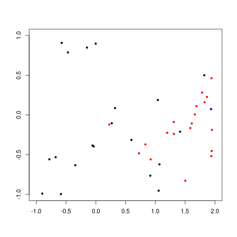
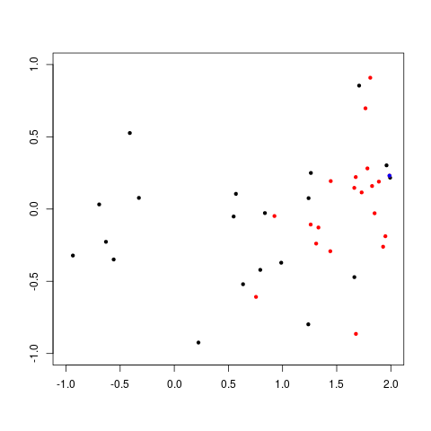

Prerequisites
=============

The only prerequisites should be Rust and its package manager Cargo, which
usually come together. Cargo will pull in other requirements. The simplest way
to get started is with the [rustup script](https://rustup.rs/).

The project has extra prerequisites which are stated in that subsection.

Task 1
======

You can run like so:

 $ cargo run -- -s 41cc89fe9eb4edfc4c947510b3dd20ff -vv

The switch -s supplies a seed to the PRNG and the number of -v flags passed
control verbosity.

The final results for this seed are as follows::

    Final results
    #0 <Gene 01fa x1: fa = 4.90625 x2: 01 = 1.015625> fitness: 38.269287
    #1 <Gene 01fa x1: fa = 4.90625 x2: 01 = 1.015625> fitness: 38.269287
    #2 <Gene 01fa x1: fa = 4.90625 x2: 01 = 1.015625> fitness: 38.269287
    #3 <Gene 01fa x1: fa = 4.90625 x2: 01 = 1.015625> fitness: 38.269287
    #4 <Gene 01fa x1: fa = 4.90625 x2: 01 = 1.015625> fitness: 38.269287
    #5 <Gene 01fa x1: fa = 4.90625 x2: 01 = 1.015625> fitness: 38.269287
    #6 <Gene 01fa x1: fa = 4.90625 x2: 01 = 1.015625> fitness: 38.269287
    #7 <Gene 01fa x1: fa = 4.90625 x2: 01 = 1.015625> fitness: 38.269287
    #8 <Gene 01fa x1: fa = 4.90625 x2: 01 = 1.015625> fitness: 38.269287
    #9 <Gene 01fa x1: fa = 4.90625 x2: 01 = 1.015625> fitness: 38.269287

Task 2
======

*Q1*: Record the first 100 iterations, do you observe any differences between the implementations
of the two paradigms?

To run and log for the global neighborhood:

 $ cargo run --bin task2 -- -v -s 41cc89fe9eb4edfc4c947510b3dd20ff -g 100

To run and log for the ring neighborhood:

 $ cargo run --bin task2 -- -v -s 41cc89fe9eb4edfc4c947510b3dd20ff --ring -g 100

Plots below were generated by passing the --csv command line option and then running an R script, eg:

 $ cargo run --bin task2 -- -s 41cc89fe9eb4edfc4c947510b3dd20ff --ring -g 100 --csv 100ring.csv
 $ Rscript plots/task2_plots.R plots/100ring.csv plots/100ring.png

Ring after 10 iterations:

    Overall best <PSOBest x1: 1.9340348 x2: 0.07338546 fitness: -1.9497257>
    #0 <State x1: -0.5717802 x2: 0.9070381 vx1: 1.5444194 vx2: 1.4150645> fitness: 0.9760893 best: <PSOBest x1: 1.9429963 x2: 0.46208596 fitness: -1.7632478>
    #1 <State x1: -0.4694395 x2: 0.78721595 vx1: 0.98308694 vx2: -1.2445512> fitness: 0.9215882 best: <PSOBest x1: 1.7834487 x2: 0.28122735 fitness: -1.7113105>
    #2 <State x1: -0.1497109 x2: 0.8474562 vx1: -2.9985137 vx2: 0.094422966> fitness: 0.82834756 best: <PSOBest x1: 1.9452598 x2: -0.45348847 fitness: -1.453204>
    #3 <State x1: -0.002304256 x2: 0.898286 vx1: -0.8017413 vx2: -1.2615702> fitness: 0.78353345 best: <PSOBest x1: 1.5871985 x2: -0.16487193 fitness: -1.5425041>
    #4 <State x1: -0.78022647 x2: -0.55843276 vx1: -2.9591444 vx2: -0.49342087> fitness: 0.21815547 best: <PSOBest x1: 1.5023246 x2: -0.827932 fitness: -0.9417303>
    #5 <State x1: -0.67494845 x2: -0.5320506 vx1: 2.6211946 vx2: -1.4592249> fitness: 0.12996837 best: <PSOBest x1: 0.832489 x2: -0.3712119 fitness: -0.97580737>
    #6 <State x1: -0.89934826 x2: -0.9899281 vx1: 0.3245916 vx2: -0.3733598> fitness: -0.065858275 best: <PSOBest x1: 1.8263876 x2: 0.15941262 fitness: -1.8212568>
    #7 <State x1: 0.32254624 x2: 0.08611894 vx1: 2.9082925 vx2: -0.736094> fitness: -0.23859471 best: <PSOBest x1: 1.6889932 x2: 0.10979414 fitness: -1.6817963>
    #8 <State x1: -0.34415746 x2: -0.6333087 vx1: -2.8859646 vx2: -0.8192734> fitness: -0.31147373 best: <PSOBest x1: 1.6113889 x2: -0.107396364 fitness: -1.5886651>
    #9 <State x1: -0.05691719 x2: -0.38455844 vx1: -2.9471722 vx2: -0.5605144> fitness: -0.324958 best: <PSOBest x1: 1.9495147 x2: -0.18823522 fitness: -1.8136165>
    #10 <State x1: -0.035954714 x2: -0.39654064 vx1: -1.2188672 vx2: -2.7412338> fitness: -0.35491088 best: <PSOBest x1: 0.7239516 x2: -0.48197126 fitness: -0.93475336>
    #11 <State x1: 0.26807988 x2: -0.10440612 vx1: -1.0411639 vx2: 1.9846556> fitness: -0.3656832 best: <PSOBest x1: 1.3092438 x2: -0.08906174 fitness: -1.3219398>
    #12 <State x1: -0.5861335 x2: -0.99600697 vx1: 1.4946961 vx2: -2.150187> fitness: -0.40497515 best: <PSOBest x1: 1.1978891 x2: -0.22468555 fitness: -1.221493>
    #13 <State x1: 0.5981045 x2: -0.31389546 vx1: -0.14057708 vx2: 2.0845335> fitness: -0.79962444 best: <PSOBest x1: 1.3105731 x2: -0.23916817 fitness: -1.3006147>
    #14 <State x1: 1.0418915 x2: 0.18809617 vx1: 0.1934602 vx2: -2.0714002> fitness: -0.91193646 best: <PSOBest x1: 1.8668578 x2: 0.22693145 fitness: -1.8410686>
    #15 <State x1: 1.0544509 x2: -0.9535072 vx1: -1.2804383 vx2: 0.6688616> fitness: -0.9548991 best: <PSOBest x1: 1.6620667 x2: 0.0059911013 fitness: -1.6625532>
    #16 <State x1: 0.91440773 x2: -0.76413053 vx1: 2.9930148 vx2: -0.20460516> fitness: -0.9995603 best: <PSOBest x1: 0.9213929 x2: -0.5595254 fitness: -1.0226808>
    #17 <State x1: 1.0692399 x2: -0.6221678 vx1: -0.014021575 vx2: -2.3884609> fitness: -1.0510535 best: <PSOBest x1: 1.939114 x2: -0.51892185 fitness: -1.3491647>
    #18 <State x1: 1.41498 x2: -0.21060239 vx1: 0.44863242 vx2: -0.008697182> fitness: -1.3873279 best: <PSOBest x1: 1.9340348 x2: 0.07338546 fitness: -1.9497257>
    #19 <State x1: 1.8217824 x2: 0.49950743 vx1: -0.5421073 vx2: 0.4555099> fitness: -1.5769626 best: <PSOBest x1: 0.22630918 x2: -0.1200054 fitness: -0.3397612>

Ring after 100 iterations:

    Overall best <PSOBest x1: 1.9705505 x2: 0.16273236 fitness: -1.9827678>
    #0 <State x1: 0.06433654 x2: 0.22087796 vx1: -2.9999976 vx2: -0.0037267148> fitness: 0.15728933 best: <PSOBest x1: 1.9188898 x2: 0.22605133 fitness: -1.9020554>
    #1 <State x1: 0.48644662 x2: 0.51423144 vx1: 2.9766963 vx2: 0.37320042> fitness: 0.050094277 best: <PSOBest x1: 1.8987108 x2: 0.22299063 fitness: -1.8799948>
    #2 <State x1: 0.061854124 x2: 0.09967394 vx1: -2.9995055 vx2: -0.054485336> fitness: 0.03807303 best: <PSOBest x1: 1.9340348 x2: 0.07338546 fitness: -1.9497257>
    #3 <State x1: 0.26766157 x2: 0.16371685 vx1: -3 vx2: 0.00010648224> fitness: -0.1034918 best: <PSOBest x1: 1.8126855 x2: 0.16537106 fitness: -1.8038647>
    #4 <State x1: 0.25936556 x2: 0.12943575 vx1: -2.9999862 vx2: 0.009144277> fitness: -0.1303344 best: <PSOBest x1: 1.9403554 x2: -0.0008625984 fitness: -1.9400424>
    #5 <State x1: 0.10534716 x2: -0.026963934 vx1: -2.9971015 vx2: -0.13184509> fitness: -0.13208182 best: <PSOBest x1: 1.7858474 x2: 0.10617542 fitness: -1.7885544>
    #6 <State x1: 0.004911661 x2: -0.16144504 vx1: -2.9995098 vx2: -0.05424268> fitness: -0.16552958 best: <PSOBest x1: 1.6113889 x2: -0.107396364 fitness: -1.5886651>
    #7 <State x1: 0.09824777 x2: -0.11027799 vx1: -2.9999044 vx2: -0.023939006> fitness: -0.20659117 best: <PSOBest x1: 1.9495147 x2: -0.18823522 fitness: -1.8136165>
    #8 <State x1: 0.4961548 x2: 0.23796724 vx1: 2.9999726 vx2: -0.012783695> fitness: -0.2622606 best: <PSOBest x1: 1.9429963 x2: 0.46208596 fitness: -1.7632478>
    #9 <State x1: 0.47921467 x2: 0.21869858 vx1: 2.9999995 vx2: 0.0013622777> fitness: -0.26482 best: <PSOBest x1: 1.974158 x2: 0.21283196 fitness: -1.971519>
    #10 <State x1: 0.4850366 x2: 0.18224515 vx1: 2.999943 vx2: -0.01849328> fitness: -0.30911118 best: <PSOBest x1: 1.7834487 x2: 0.28122735 fitness: -1.7113105>
    #11 <State x1: 0.73204297 x2: 0.41370356 vx1: -0.9817806 vx2: -1.6905558> fitness: -0.32604882 best: <PSOBest x1: 1.9705505 x2: 0.16273236 fitness: -1.9827678>
    #12 <State x1: 0.33639216 x2: 0.0040923953 vx1: 2.9738514 vx2: 0.3952313> fitness: -0.33252355 best: <PSOBest x1: 1.8059665 x2: -0.33485427 fitness: -1.5473106>
    #13 <State x1: 0.5603337 x2: 0.11719799 vx1: 2.9990647 vx2: -0.0749197> fitness: -0.45369288 best: <PSOBest x1: 1.8263876 x2: 0.15941262 fitness: -1.8212568>
    #14 <State x1: 0.55664897 x2: 0.10030651 vx1: 0.30893946 vx2: -2.723108> fitness: -0.4660836 best: <PSOBest x1: 1.9034448 x2: -0.009698629 fitness: -1.9000987>
    #15 <State x1: 1.0828811 x2: 0.6060003 vx1: 0.095620275 vx2: 1.4539053> fitness: -0.5250089 best: <PSOBest x1: 1.8503101 x2: -0.011602521 fitness: -1.8468602>
    #16 <State x1: 0.6612685 x2: -0.049432833 vx1: 2.9995055 vx2: -0.054471854> fitness: -0.69865376 best: <PSOBest x1: 1.8217824 x2: 0.49950743 fitness: -1.5769626>
    #17 <State x1: 0.9085195 x2: 0.15813312 vx1: 2.9996243 vx2: -0.047491763> fitness: -0.78952175 best: <PSOBest x1: 1.6889932 x2: 0.10979414 fitness: -1.6817963>
    #18 <State x1: 0.98852444 x2: 0.03358209 vx1: 2.9861922 vx2: -0.2874964> fitness: -0.9689468 best: <PSOBest x1: 1.9502114 x2: 0.24765898 fitness: -1.9283004>
    #19 <State x1: 1.115161 x2: -0.18218881 vx1: -0.43546993 vx2: 0.08254528> fitness: -1.1590612 best: <PSOBest x1: 1.8976824 x2: -0.26486075 fitness: -1.6892297>

Global after 10 iterations:

    Overall best <PSOBest x1: 1.9875042 x2: 0.23076205 fitness: -1.979593>
    #0 <State x1: -0.41057038 x2: 0.5263072 vx1: 1.3227134 vx2: -1.0610443> fitness: 0.7821075 best: <PSOBest x1: 1.4407828 x2: -0.29197717 fitness: -1.3649223>
    #1 <State x1: -0.6936474 x2: 0.03188169 vx1: 0.64879525 vx2: -2.929004> fitness: 0.7174533 best: <PSOBest x1: 1.8263876 x2: 0.15941262 fitness: -1.8212568>
    #2 <State x1: -0.9365682 x2: -0.32199383 vx1: 0.049633346 vx2: -1.1769775> fitness: 0.66106737 best: <PSOBest x1: 1.9287485 x2: -0.26095986 fitness: -1.7153802>
    #3 <State x1: -0.6311038 x2: -0.22683716 vx1: -0.23816282 vx2: -1.3061688> fitness: 0.41864297 best: <PSOBest x1: 1.3312223 x2: -0.1278882 fitness: -1.3400638>
    #4 <State x1: -0.3267808 x2: 0.07717043 vx1: 2.3376231 vx2: 0.318909> fitness: 0.39786038 best: <PSOBest x1: 1.765658 x2: 0.69740313 fitness: -1.312254>
    #5 <State x1: -0.55984426 x2: -0.34913266 vx1: -2.9968722 vx2: -0.13695437> fitness: 0.20915744 best: <PSOBest x1: 1.677362 x2: -0.86432505 fitness: -0.8792001>
    #6 <State x1: 0.56945074 x2: 0.10520935 vx1: -1.1062567 vx2: 1.8839203> fitness: -0.4747728 best: <PSOBest x1: 1.6757075 x2: 0.22128916 fitness: -1.620465>
    #7 <State x1: 0.5482092 x2: -0.05176971 vx1: 2.9995658 vx2: 0.051025003> fitness: -0.59090745 best: <PSOBest x1: 0.7547015 x2: -0.6082432 fitness: -0.96716374>
    #8 <State x1: 0.8370397 x2: -0.027884007 vx1: -1.261809 vx2: 2.152749> fitness: -0.8550599 best: <PSOBest x1: 1.7834487 x2: 0.28122735 fitness: -1.7113105>
    #9 <State x1: 0.22313595 x2: -0.9242737 vx1: 1.4927571 vx2: 0.9605928> fitness: -0.89873064 best: <PSOBest x1: 1.7303789 x2: 0.115133524 fitness: -1.7259965>
    #10 <State x1: 0.63508177 x2: -0.5204243 vx1: 2.9677413 vx2: -0.43876058> fitness: -0.90002966 best: <PSOBest x1: 0.92504895 x2: -0.04848647 fitness: -0.9520469>
    #11 <State x1: 0.79421616 x2: -0.42119336 vx1: -1.843263 vx2: 0.8924892> fitness: -0.96108866 best: <PSOBest x1: 1.6624784 x2: 0.14656925 fitness: -1.6408862>
    #12 <State x1: 1.2376273 x2: -0.79805326 vx1: -0.61220413 vx2: -2.768761> fitness: -0.99024475 best: <PSOBest x1: 1.8498313 x2: -0.029292345 fitness: -1.8401786>
    #13 <State x1: 0.98756194 x2: -0.37165725 vx1: -2.4731724 vx2: -0.3250537> fitness: -1.0677083 best: <PSOBest x1: 1.9495147 x2: -0.18823522 fitness: -1.8136165>
    #14 <State x1: 1.7068982 x2: 0.8541968 vx1: -0.7095272 vx2: 1.8155262> fitness: -1.089155 best: <PSOBest x1: 1.8099866 x2: 0.9087784 fitness: -1.1781647>
    #15 <State x1: 1.2614377 x2: 0.249645 vx1: -0.2568336 vx2: 2.988986> fitness: -1.1122168 best: <PSOBest x1: 1.4447378 x2: 0.19337386 fitness: -1.3685007>
    #16 <State x1: 1.240256 x2: 0.07511997 vx1: -0.4492091 vx2: -2.966178> fitness: -1.2089388 best: <PSOBest x1: 1.2596109 x2: -0.10734582 fitness: -1.2780664>
    #17 <State x1: 1.6631427 x2: -0.4714799 vx1: -0.8875596 vx2: 1.779707> fitness: -1.3187894 best: <PSOBest x1: 1.3105731 x2: -0.23916817 fitness: -1.3006147>
    #18 <State x1: 1.96016 x2: 0.30249363 vx1: -1.4948971 vx2: 0.99681944> fitness: -1.9089199 best: <PSOBest x1: 1.8891541 x2: 0.18974686 fitness: -1.8825375>
    #19 <State x1: 1.9933203 x2: 0.21691212 vx1: -0.069430694 vx2: 0.16533643> fitness: -1.9919994 best: <PSOBest x1: 1.9875042 x2: 0.23076205 fitness: -1.979593>

Global after 100 iterations:

    Overall best <PSOBest x1: 1.9833502 x2: 0.12644362 fitness: -2.002702>
    #0 <State x1: 0.10392642 x2: 0.76721513 vx1: -1.492969 vx2: 0.48183176> fitness: 0.62496877 best: <PSOBest x1: 1.9933203 x2: 0.21691212 fitness: -1.9919994>
    #1 <State x1: -0.12091327 x2: 0.1507155 vx1: -2.9898016 vx2: 0.24715304> fitness: 0.26727703 best: <PSOBest x1: 1.897733 x2: -0.046159208 fitness: -1.8788798>
    #2 <State x1: 0.16458869 x2: 0.28161478 vx1: -2.999526 vx2: 0.053318717> fitness: 0.1216567 best: <PSOBest x1: 1.9831889 x2: 0.22029376 fitness: -1.9789822>
    #3 <State x1: 0.04744315 x2: 0.08819687 vx1: -2.9977746 vx2: 0.11553322> fitness: 0.040906504 best: <PSOBest x1: 1.9282087 x2: -0.042858362 fitness: -1.9096838>
    #4 <State x1: 0.28008962 x2: 0.20564276 vx1: -2.9998903 vx2: 0.025662655> fitness: -0.07248649 best: <PSOBest x1: 1.9072517 x2: 0.24276233 fitness: -1.8804677>
    #5 <State x1: 0.20888472 x2: 0.12644371 vx1: -3 vx2: -0.00000031885799> fitness: -0.08223179 best: <PSOBest x1: 1.9833502 x2: 0.12644362 fitness: -2.002702>
    #6 <State x1: 0.26017666 x2: 0.16061118 vx1: -2.9999998 vx2: 0.001107787> fitness: -0.09909463 best: <PSOBest x1: 1.7870549 x2: 0.17055619 fitness: -1.7729602>
    #7 <State x1: 0.060777664 x2: -0.059582535 vx1: -2.9996607 vx2: -0.04511374> fitness: -0.120000005 best: <PSOBest x1: 1.9495147 x2: -0.18823522 fitness: -1.8136165>
    #8 <State x1: 0.090156555 x2: -0.047916353 vx1: -2.9941554 vx2: -0.18717307> fitness: -0.13765353 best: <PSOBest x1: 1.8875914 x2: 0.06746769 fitness: -1.90004>
    #9 <State x1: 0.22998166 x2: 0.044192802 vx1: -2.999831 vx2: -0.031828675> fitness: -0.18651815 best: <PSOBest x1: 1.8190562 x2: 0.07117471 fitness: -1.8273617>
    #10 <State x1: -0.54852164 x2: -0.7744461 vx1: 0.4301556 vx2: 1.6917295> fitness: -0.2538514 best: <PSOBest x1: 1.9364146 x2: 0.12955523 fitness: -1.9506392>
    #11 <State x1: 0.5048344 x2: 0.14633362 vx1: 2.9999914 vx2: -0.007158762> fitness: -0.36662817 best: <PSOBest x1: 1.6900438 x2: 0.16653275 fitness: -1.6641583>
    #12 <State x1: 0.5436959 x2: 0.13078417 vx1: 3 vx2: 0.00008219363> fitness: -0.42294607 best: <PSOBest x1: 1.6624784 x2: 0.14656925 fitness: -1.6408862>
    #13 <State x1: 0.7146692 x2: 0.2617698 vx1: 2.9999988 vx2: -0.002693855> fitness: -0.4733711 best: <PSOBest x1: 1.9217763 x2: 0.3749888 fitness: -1.8107848>
    #14 <State x1: 0.54466796 x2: 0.047228742 vx1: 2.999986 vx2: -0.009159309> fitness: -0.5030761 best: <PSOBest x1: 1.8670002 x2: -0.08046591 fitness: -1.8315277>
    #15 <State x1: 0.63933206 x2: 0.11587111 vx1: 2.9999878 vx2: 0.008560815> fitness: -0.5380841 best: <PSOBest x1: 1.9572586 x2: 0.070313215 fitness: -1.9741098>
    #16 <State x1: 0.59833145 x2: 0.03311796 vx1: 2.9996493 vx2: 0.045868315> fitness: -0.5703163 best: <PSOBest x1: 1.8804188 x2: -0.036214232 fitness: -1.866924>
    #17 <State x1: 0.71694994 x2: 0.13062 vx1: 2.9999995 vx2: 0.0018122293> fitness: -0.6067395 best: <PSOBest x1: 1.9524283 x2: 0.13137698 fitness: -1.96809>
    #18 <State x1: 0.85763 x2: 0.17613012 vx1: 2.998613 vx2: -0.09120479> fitness: -0.7171902 best: <PSOBest x1: 1.7934151 x2: 0.28810143 fitness: -1.7186978>
    #19 <State x1: 1.040319 x2: 0.32903662 vx1: 2.9990816 vx2: -0.074223846> fitness: -0.7752046 best: <PSOBest x1: 1.765658 x2: 0.69740313 fitness: -1.312254>

In the plots, black is the position of points, red is the personal bests and
green is the best known solution.

As you can see, the local best/ring neighborhood does seem to have slightly
more diversity than the global best, however this is not the best setting to
make comparisons (see *extra comments*).

*Q2*: Are the solutions found after 2000 iterations different?

Ring after 2000 iterations:

    Overall best <PSOBest x1: 1.9956509 x2: 0.06753039 fitness: -2.0144055>
    #0 <State x1: -0.13921523 x2: 0.06436453 vx1: -3 vx2: 0.00030080593> fitness: 0.2023387 best: <PSOBest x1: 1.8728683 x2: 0.06285456 fitness: -1.8841852>
    #1 <State x1: 0.07428527 x2: 0.21648806 vx1: -2.999993 vx2: -0.0065384023> fitness: 0.143249 best: <PSOBest x1: 1.9188898 x2: 0.22605133 fitness: -1.9020554>
    #2 <State x1: 0.20230412 x2: 0.2531695 vx1: -2.9997416 vx2: 0.03939417> fitness: 0.055247054 best: <PSOBest x1: 1.7834487 x2: 0.28122735 fitness: -1.7113105>
    #3 <State x1: 0.20482183 x2: 0.1851775 vx1: -2.9999447 vx2: 0.01823496> fitness: -0.017758831 best: <PSOBest x1: 1.8886738 x2: 0.22129965 fitness: -1.8691013>
    #4 <State x1: 0.26797438 x2: 0.16426496 vx1: -3 vx2: -0.0003598836> fitness: -0.103242785 best: <PSOBest x1: 1.8126855 x2: 0.16537106 fitness: -1.8038647>
    #5 <State x1: 0.20196843 x2: 0.060922205 vx1: -2.9973269 vx2: -0.12661585> fitness: -0.14157464 best: <PSOBest x1: 1.9705505 x2: 0.16273236 fitness: -1.9827678>
    #6 <State x1: 0.2968135 x2: 0.067320555 vx1: -3 vx2: -0.00016112642> fitness: -0.23114614 best: <PSOBest x1: 1.8344373 x2: 0.06720558 fitness: -1.8436894>
    #7 <State x1: 0.38689756 x2: 0.08418128 vx1: -2.9987977 vx2: 0.08492458> fitness: -0.3063082 best: <PSOBest x1: 1.9403554 x2: -0.0008625984 fitness: -1.9400424>
    #8 <State x1: 0.6555593 x2: 0.22141913 vx1: 2.9999993 vx2: 0.0023530805> fitness: -0.4508317 best: <PSOBest x1: 1.974158 x2: 0.21283196 fitness: -1.971519>
    #9 <State x1: 0.5231149 x2: 0.066234715 vx1: 2.9999995 vx2: 0.0014422097> fitness: -0.46349502 best: <PSOBest x1: 1.9956509 x2: 0.06753039 fitness: -2.0144055>
    #10 <State x1: 0.6564572 x2: 0.14778428 vx1: 2.999994 vx2: -0.005911037> fitness: -0.5257834 best: <PSOBest x1: 1.9034448 x2: -0.009698629 fitness: -1.9000987>
    #11 <State x1: 0.55210614 x2: 0.022645563 vx1: 2.997693 vx2: 0.1176265> fitness: -0.53254384 best: <PSOBest x1: 1.9204892 x2: -0.10604441 fitness: -1.862869>
    #12 <State x1: 0.4761939 x2: -0.100772515 vx1: 2.999464 vx2: -0.056708135> fitness: -0.5608164 best: <PSOBest x1: 1.9013047 x2: -0.17692655 fitness: -1.7864767>
    #13 <State x1: 0.66807413 x2: 0.083668806 vx1: 2.9999852 vx2: 0.009427896> fitness: -0.59782505 best: <PSOBest x1: 1.6889932 x2: 0.10979414 fitness: -1.6817963>
    #14 <State x1: 0.7431176 x2: 0.16844967 vx1: 2.9999812 vx2: -0.010559957> fitness: -0.59915894 best: <PSOBest x1: 1.9520739 x2: 0.12521267 fitness: -1.9684122>
    #15 <State x1: 0.70660233 x2: 0.1176846 vx1: 3 vx2: -0.00027621083> fitness: -0.6076487 best: <PSOBest x1: 1.7858474 x2: 0.10617542 fitness: -1.7885544>
    #16 <State x1: 0.5232215 x2: -0.13665795 vx1: 0.20050383 vx2: 2.229132> fitness: -0.63163614 best: <PSOBest x1: 1.9495147 x2: -0.18823522 fitness: -1.8136165>
    #17 <State x1: 0.8002691 x2: 0.08589814 vx1: 2.9999995 vx2: 0.0017852681> fitness: -0.7346519 best: <PSOBest x1: 1.9340348 x2: 0.07338546 fitness: -1.9497257>
    #18 <State x1: 0.8468642 x2: 0.0963112 vx1: 2.9999917 vx2: 0.00715602> fitness: -0.7753893 best: <PSOBest x1: 1.9660679 x2: 0.12411094 fitness: -1.9839103>
    #19 <State x1: 0.9131067 x2: 0.17324036 vx1: 2.9999933 vx2: 0.0064069717> fitness: -0.7811296 best: <PSOBest x1: 1.8263876 x2: 0.15941262 fitness: -1.8212568>

Global after 2000 iterations:

    Overall best <PSOBest x1: 1.9833502 x2: 0.12644362 fitness: -2.002702>
    #0 <State x1: -0.09134197 x2: 0.16435294 vx1: -2.9999928 vx2: 0.006565463> fitness: 0.2518715 best: <PSOBest x1: 1.9831889 x2: 0.22029376 fitness: -1.9789822>
    #1 <State x1: 0.16599941 x2: 0.19635053 vx1: -2.999999 vx2: 0.0025344365> fitness: 0.03257236 best: <PSOBest x1: 1.7934151 x2: 0.28810143 fitness: -1.7186978>
    #2 <State x1: 0.10580659 x2: 0.08883248 vx1: -2.9999993 vx2: -0.0021529621> fitness: -0.01675862 best: <PSOBest x1: 1.8190562 x2: 0.07117471 fitness: -1.8273617>
    #3 <State x1: 0.0756259 x2: 0.053439274 vx1: -2.9999075 vx2: 0.02359261> fitness: -0.02214937 best: <PSOBest x1: 1.972603 x2: -0.08513838 fitness: -1.9251516>
    #4 <State x1: 0.20888472 x2: 0.12644362 vx1: -3 vx2: 0> fitness: -0.08223188 best: <PSOBest x1: 1.9833502 x2: 0.12644362 fitness: -2.002702>
    #5 <State x1: 0.31218648 x2: 0.139393 vx1: -2.999998 vx2: 0.0032435143> fitness: -0.17401001 best: <PSOBest x1: 1.8937445 x2: 0.15541478 fitness: -1.898207>
    #6 <State x1: 0.2722497 x2: 0.083046794 vx1: -2.9999416 vx2: -0.018723197> fitness: -0.1904888 best: <PSOBest x1: 1.8875914 x2: 0.06746769 fitness: -1.90004>
    #7 <State x1: 0.32723498 x2: 0.07085289 vx1: -2.9991746 vx2: 0.07037248> fitness: -0.2585635 best: <PSOBest x1: 1.8804188 x2: -0.036214232 fitness: -1.866924>
    #8 <State x1: 0.5201721 x2: 0.24379691 vx1: 2.9909983 vx2: 0.2322276> fitness: -0.28152788 best: <PSOBest x1: 1.8670002 x2: -0.08046591 fitness: -1.8315277>
    #9 <State x1: 0.49241805 x2: 0.15493393 vx1: 2.9999416 vx2: -0.018714594> fitness: -0.34489384 best: <PSOBest x1: 1.7870549 x2: 0.17055619 fitness: -1.7729602>
    #10 <State x1: 0.52677345 x2: 0.13656841 vx1: 2.9999824 vx2: -0.0103151705> fitness: -0.39944082 best: <PSOBest x1: 1.6624784 x2: 0.14656925 fitness: -1.6408862>
    #11 <State x1: 0.5148618 x2: 0.084529996 vx1: 2.9999464 vx2: -0.017948776> fitness: -0.43772507 best: <PSOBest x1: 1.9572586 x2: 0.070313215 fitness: -1.9741098>
    #12 <State x1: 0.5415554 x2: 0.05715961 vx1: 2.9999886 vx2: -0.008269632> fitness: -0.49083796 best: <PSOBest x1: 1.9282087 x2: -0.042858362 fitness: -1.9096838>
    #13 <State x1: 0.7158489 x2: 0.12790668 vx1: 3 vx2: 0.00013725611> fitness: -0.6080787 best: <PSOBest x1: 1.9524283 x2: 0.13137698 fitness: -1.96809>
    #14 <State x1: 0.76360345 x2: 0.17816488 vx1: 2.9997685 vx2: 0.037282113> fitness: -0.612093 best: <PSOBest x1: 1.9933203 x2: 0.21691212 fitness: -1.9919994>
    #15 <State x1: 0.7230747 x2: 0.12911943 vx1: 3 vx2: 0.00009391838> fitness: -0.6146757 best: <PSOBest x1: 1.9364146 x2: 0.12955523 fitness: -1.9506392>
    #16 <State x1: 0.6268885 x2: -0.031762123 vx1: -2.801394 vx2: 1.0734023> fitness: -0.65197515 best: <PSOBest x1: 1.9495147 x2: -0.18823522 fitness: -1.8136165>
    #17 <State x1: 0.74999356 x2: 0.083596 vx1: 2.9999995 vx2: 0.001582759> fitness: -0.68369335 best: <PSOBest x1: 1.8748629 x2: 0.06954929 fitness: -1.886644>
    #18 <State x1: 0.77047944 x2: -0.00903362 vx1: 2.9980876 vx2: -0.10710035> fitness: -0.7768988 best: <PSOBest x1: 1.9181634 x2: -0.0688983 fitness: -1.8856648>
    #19 <State x1: 1.2048497 x2: 0.12422969 vx1: 3 vx2: -0.0003573752> fitness: -1.1421984 best: <PSOBest x1: 1.8475444 x2: 0.122790895 fitness: -1.8535675>

*With this seed*, the ring topology finds a different, better solution,
however, with better parameters they would both converge and produce almost
identical soutions.

*Extra comments*: These aren't very good parameters. Since phi = c_1 + c_2 = 4,
the particles will not converge, furthermore, since vmax = 3 and the domain of
x1 goes from -1..2, a length of 3, the particles will always end up with vx1
= 3 and vx2 = 0 since particles will at some point end up in approximately the
the correct place on the x2 axis, but always take the maximum step on the x1
axis, back to their original position or near it, and therefore get sent in the
same direction again. Essentially they will reach their natural frequency in
the x1 axis, so damping needs to be applied in the form of inertia,
constriction or vmax.

See:

M. Clerc and J. Kennedy, "The particle swarm - explosion, stability, and convergence in a multidimensional complex space," in IEEE Transactions on Evolutionary Computation, vol. 6, no. 1, pp. 58-73, Feb 2002. doi: 10.1109/4235.985692 URL: http://ieeexplore.ieee.org/stamp/stamp.jsp?tp=&arnumber=985692&isnumber=21241

Task 3
======

Q: Compare the penalty functions.

With linear crossover, the following is produce for dynamic penalty

    $ cargo run --bin task3 -- -s 41cc89fe9eb4edfc4c947510b3dd20ff -g 50 -t dynamic

    Final results
    #0 Gene(Matrix { data: [-4.5113077, 0.5429516] }) fitness: -104844.75 inf: 1
    #1 Gene(Matrix { data: [-4.1173477, 2.46162] }) fitness: -72226.42 inf: 1
    #2 Gene(Matrix { data: [-4.387608, 4.056757] }) fitness: -55313.887 inf: 1
    #3 Gene(Matrix { data: [-3.6257484, 3.5468183] }) fitness: -53883.625 inf: 1
    #4 Gene(Matrix { data: [-4.3135457, 4.2824078] }) fitness: -52052.03 inf: 1
    #5 Gene(Matrix { data: [-4.16936, 4.250629] }) fitness: -51068.87 inf: 1
    #6 Gene(Matrix { data: [-3.7368035, 4.1552916] }) fitness: -48175.582 inf: 1
    #7 Gene(Matrix { data: [-3.773822, 4.358116] }) fitness: -46343.91 inf: 1
    #8 Gene(Matrix { data: [-4.1295214, 4.9398217] }) fitness: -43383.61 inf: 1
    #9 Gene(Matrix { data: [-4.091359, 4.95936] }) fitness: -42861.277 inf: 1
    #10 Gene(Matrix { data: [-2.6100378, 3.8425143] }) fitness: -41677.09 inf: 1
    #11 Gene(Matrix { data: [-4.6750913, 6.511933] }) fitness: -32729.322 inf: 1
    #12 Gene(Matrix { data: [3.753212, 2.8890576] }) fitness: -9530.451 inf: 1
    #13 Gene(Matrix { data: [-2.7861433, 10.385808] }) fitness: -2257.343 inf: 1
    #14 Gene(Matrix { data: [1.5113522, 8.277955] }) fitness: -138.23344 inf: 1
    #15 Gene(Matrix { data: [9.913637, 12.261999] }) fitness: -22.175636 inf: 0
    #16 Gene(Matrix { data: [9.083775, 7.665818] }) fitness: -16.749592 inf: 0
    #17 Gene(Matrix { data: [3.0505474, 13.292371] }) fitness: -16.342918 inf: 0
    #18 Gene(Matrix { data: [8.538727, 7.156195] }) fitness: -15.6949215 inf: 0
    #19 Gene(Matrix { data: [-4.63857, 14.077328] }) fitness: -9.438758 inf: 0

With linear crossover, the following is produce for static penalty:

    $ cargo run --bin task3 -- -s 41cc89fe9eb4edfc4c947510b3dd20ff -g 50 -t static

    #0 Gene(Matrix { data: [-4.1173477, 2.46162] }) fitness: -500000000.0 inf: 1
    #1 Gene(Matrix { data: [-4.6750913, 6.511933] }) fitness: -500000000.0 inf: 1
    #2 Gene(Matrix { data: [-3.7368035, 4.1552916] }) fitness: -500000000.0 inf: 1
    #3 Gene(Matrix { data: [-4.16936, 4.250629] }) fitness: -500000000.0 inf: 1
    #4 Gene(Matrix { data: [-4.1295214, 4.9398217] }) fitness: -500000000.0 inf: 1
    #5 Gene(Matrix { data: [3.753212, 2.8890576] }) fitness: -500000000.0 inf: 1
    #6 Gene(Matrix { data: [1.5113522, 8.277955] }) fitness: -500000000.0 inf: 1
    #7 Gene(Matrix { data: [-3.6257484, 3.5468183] }) fitness: -500000000.0 inf: 1
    #8 Gene(Matrix { data: [-3.773822, 4.358116] }) fitness: -500000000.0 inf: 1
    #9 Gene(Matrix { data: [-2.6100378, 3.8425143] }) fitness: -500000000.0 inf: 1
    #10 Gene(Matrix { data: [-2.7861433, 10.385808] }) fitness: -500000000.0 inf: 1
    #11 Gene(Matrix { data: [-4.387608, 4.056757] }) fitness: -500000000.0 inf: 1
    #12 Gene(Matrix { data: [-4.091359, 4.95936] }) fitness: -500000000.0 inf: 1
    #13 Gene(Matrix { data: [-4.3135457, 4.2824078] }) fitness: -500000000.0 inf: 1
    #14 Gene(Matrix { data: [-4.5113077, 0.5429516] }) fitness: -500000000.0 inf: 1
    #15 Gene(Matrix { data: [9.913637, 12.261999] }) fitness: -22.175636 inf: 0
    #16 Gene(Matrix { data: [9.083775, 7.665818] }) fitness: -16.749592 inf: 0
    #17 Gene(Matrix { data: [3.0505474, 13.292371] }) fitness: -16.342918 inf: 0
    #18 Gene(Matrix { data: [8.538727, 7.156195] }) fitness: -15.6949215 inf: 0
    #19 Gene(Matrix { data: [-4.63857, 14.077328] }) fitness: -9.438758 inf: 0

Notice in this case there is very little difference given the same seed.

With linear crossover, death penalty will not run since linear crossover
deterministically selects children, meaning it can keep on selecting infeasible
children over and over again causing an infinite loop if we implement death
penalty as directed in the review paper.

Now for undx: static, dynamic and death penalty:

    $ cargo run --bin task3 -- -s 41cc89fe9eb4edfc4c947510b3dd20ff -g 50 -t static --xover-op udnx

    Final results
    #0 Gene(Matrix { data: [-4.6687684, 2.322264] }) fitness: -500000000.0 inf: 1
    #1 Gene(Matrix { data: [-4.6687684, 2.322264] }) fitness: -500000000.0 inf: 1
    #2 Gene(Matrix { data: [6.5202227, 4.4029083] }) fitness: -500000000.0 inf: 1
    #3 Gene(Matrix { data: [-1.0948486, 6.8312607] }) fitness: -500000000.0 inf: 1
    #4 Gene(Matrix { data: [-2.9383564, 7.695717] }) fitness: -500000000.0 inf: 1
    #5 Gene(Matrix { data: [1.9136571, 2.4843783] }) fitness: -500000000.0 inf: 1
    #6 Gene(Matrix { data: [-4.1279263, 9.323532] }) fitness: -500000000.0 inf: 1
    #7 Gene(Matrix { data: [-3.446044, 3.3098066] }) fitness: -500000000.0 inf: 1
    #8 Gene(Matrix { data: [-3.9594402, 8.726284] }) fitness: -500000000.0 inf: 1
    #9 Gene(Matrix { data: [-3.9594402, 8.726284] }) fitness: -500000000.0 inf: 1
    #10 Gene(Matrix { data: [-1.8924379, 5.030302] }) fitness: -500000000.0 inf: 1
    #11 Gene(Matrix { data: [-2.654885, 6.567602] }) fitness: -500000000.0 inf: 1
    #12 Gene(Matrix { data: [9.2236595, 11.870246] }) fitness: -21.093906 inf: 0
    #13 Gene(Matrix { data: [9.196007, 9.697033] }) fitness: -18.89304 inf: 0
    #14 Gene(Matrix { data: [7.516514, 9.116718] }) fitness: -16.633232 inf: 0
    #15 Gene(Matrix { data: [4.467144, 11.223061] }) fitness: -15.690205 inf: 0
    #16 Gene(Matrix { data: [7.472748, 6.8858657] }) fitness: -14.358614 inf: 0
    #17 Gene(Matrix { data: [1.2455215, 11.539139] }) fitness: -12.78466 inf: 0
    #18 Gene(Matrix { data: [-2.3451548, 13.873457] }) fitness: -11.528302 inf: 0
    #19 Gene(Matrix { data: [1.4033165, 9.98048] }) fitness: -11.383797 inf: 0
    Fitness evals 2394
    g1 evals 2440

    $ cargo run --bin task3 -- -s 41cc89fe9eb4edfc4c947510b3dd20ff -g 50 -t dynamic --xover-op udnx

    Final results
    #0 Gene(Matrix { data: [-4.6687684, 2.322264] }) fitness: -80327.5 inf: 1
    #1 Gene(Matrix { data: [-4.6687684, 2.322264] }) fitness: -80327.5 inf: 1
    #2 Gene(Matrix { data: [-3.446044, 3.3098066] }) fitness: -54880.637 inf: 1
    #3 Gene(Matrix { data: [-1.8924379, 5.030302] }) fitness: -25729.65 inf: 1
    #4 Gene(Matrix { data: [1.9136571, 2.4843783] }) fitness: -21047.441 inf: 1
    #5 Gene(Matrix { data: [-2.654885, 6.567602] }) fitness: -19130.152 inf: 1
    #6 Gene(Matrix { data: [-2.9383564, 7.695717] }) fitness: -13564.512 inf: 1
    #7 Gene(Matrix { data: [-3.9594402, 8.726284] }) fitness: -12558.759 inf: 1
    #8 Gene(Matrix { data: [-3.9594402, 8.726284] }) fitness: -12558.759 inf: 1
    #9 Gene(Matrix { data: [-4.1279263, 9.323532] }) fitness: -10176.308 inf: 1
    #10 Gene(Matrix { data: [-1.0948486, 6.8312607] }) fitness: -10003.189 inf: 1
    #11 Gene(Matrix { data: [6.5202227, 4.4029083] }) fitness: -26.983456 inf: 1
    #12 Gene(Matrix { data: [9.2236595, 11.870246] }) fitness: -21.093906 inf: 0
    #13 Gene(Matrix { data: [9.196007, 9.697033] }) fitness: -18.89304 inf: 0
    #14 Gene(Matrix { data: [7.516514, 9.116718] }) fitness: -16.633232 inf: 0
    #15 Gene(Matrix { data: [4.467144, 11.223061] }) fitness: -15.690205 inf: 0
    #16 Gene(Matrix { data: [7.472748, 6.8858657] }) fitness: -14.358614 inf: 0
    #17 Gene(Matrix { data: [1.2455215, 11.539139] }) fitness: -12.78466 inf: 0
    #18 Gene(Matrix { data: [-2.3451548, 13.873457] }) fitness: -11.528302 inf: 0
    #19 Gene(Matrix { data: [1.4033165, 9.98048] }) fitness: -11.383797 inf: 0
    Fitness evals 3020
    g1 evals 1814

    $ cargo run --bin task3 -- -s 41cc89fe9eb4edfc4c947510b3dd20ff -g 50 -t death --xover-op udnx

    Final results
    #0 Gene(Matrix { data: [6.1585617, 14.774284] }) fitness: -20.932846 inf: 0
    #1 Gene(Matrix { data: [7.1811295, 13.621376] }) fitness: -20.802505 inf: 0
    #2 Gene(Matrix { data: [9.81012, 9.31192] }) fitness: -19.12204 inf: 0
    #3 Gene(Matrix { data: [9.543407, 8.305458] }) fitness: -17.848866 inf: 0
    #4 Gene(Matrix { data: [7.0705857, 9.601656] }) fitness: -16.672241 inf: 0
    #5 Gene(Matrix { data: [7.0705857, 9.601656] }) fitness: -16.672241 inf: 0
    #6 Gene(Matrix { data: [1.0739992, 14.181635] }) fitness: -15.255634 inf: 0
    #7 Gene(Matrix { data: [9.5876465, 5.6349487] }) fitness: -15.222595 inf: 0
    #8 Gene(Matrix { data: [6.829262, 6.6455] }) fitness: -13.474762 inf: 0
    #9 Gene(Matrix { data: [-1.2867737, 13.878632] }) fitness: -12.591858 inf: 0
    #10 Gene(Matrix { data: [-1.2115062, 13.80036] }) fitness: -12.588854 inf: 0
    #11 Gene(Matrix { data: [-1.6098251, 14.073074] }) fitness: -12.463249 inf: 0
    #12 Gene(Matrix { data: [5.5447845, 5.8028793] }) fitness: -11.347664 inf: 0
    #13 Gene(Matrix { data: [-2.8180947, 13.746477] }) fitness: -10.928383 inf: 0
    #14 Gene(Matrix { data: [-2.8253574, 13.750282] }) fitness: -10.924925 inf: 0
    #15 Gene(Matrix { data: [-2.8909867, 13.81357] }) fitness: -10.922584 inf: 0
    #16 Gene(Matrix { data: [0.57125854, 9.95369] }) fitness: -10.524948 inf: 0
    #17 Gene(Matrix { data: [-0.725708, 10.893372] }) fitness: -10.167664 inf: 0
    #18 Gene(Matrix { data: [-1.3458557, 11.454102] }) fitness: -10.108246 inf: 0
    #19 Gene(Matrix { data: [-3.630371, 13.563568] }) fitness: -9.933197 inf: 0
    Fitness evals 3020
    g1 evals 3563

Here the death penalty performs much better, possibly because in this case
combining with infeasible solutions doesn't offer a great advantage -- however
tweaking the selection parameters to something more elitist would perhaps give
static and dynamic penalty a better chance. Note that the death penalty
performs the most function evaluations of the feasibility constraints and so
perhaps a fair comparison would hold this statistic constant rather than
generations.

Task 4
======

Q1: Your implementations of the fast non-dominated sorting and the calculation
   of the crowding distance.
Q2: Results of the fast non-dominated sorting.
Q3: The crowding distances of each individual.

Q1 is in task4.rs, which can be run like so:

    $ cargo run --bin task4

Resulting in the output, addressing Q2 and Q3:

    front 0: {1, 2}
    front 1: {3, 4}
    front 2: {5}
    front 3: {6, 7, 8, 12}
    front 4: {9, 11}
    front 5: {10}
    individual 1: (0, 1) rank: 0 crowding: inf
    individual 2: (1, 0) rank: 0 crowding: inf
    individual 3: (2, 1.5) rank: 1 crowding: inf
    individual 4: (1.5, 3) rank: 1 crowding: inf
    individual 5: (3, 1.6) rank: 2 crowding: inf
    individual 8: (5, 2.5) rank: 3 crowding: inf
    individual 12: (3.3, 6.5) rank: 3 crowding: inf
    individual 6: (4, 3.5) rank: 3 crowding: 1.5558825
    individual 7: (4.5, 3.1) rank: 3 crowding: 0.83823526
    individual 9: (6, 5) rank: 4 crowding: inf
    individual 11: (4.2, 6) rank: 4 crowding: inf
    individual 10: (5.5, 7) rank: 5 crowding: inf

Q: The selected 6 individuals.

These are the first 6 above: 1, 2, 3, 4, 5, 8

An alternative solution is 1, 2, 3, 4, 5, 12

Task 4b
=======

You can choose which crossover operator to use using the option --xover-op
option. Choices are as before: udnx, linear or blend. Note that the child to
use is chosen at random since the MOEA/D algorithm assumes a single child.

Solutions are made improved/repaired by clamping them to the feasible cube.

Note that when the final results are printed, the scalarized fitness is given
with *the original z-star*. The justification for this is that it allows the
scalarized fitnesses to be compared.

Here are results for blend (which appears particularly effective for this
problem):

    $ cargo run --bin task4b -- --xover-op blend -s d9a876f733a4b667dcd70e6f09bf1399
 
    Nearest neighbors according to weight vectors
    #1: 1; 2; 3; 4
    #2: 1; 2; 3; 4
    #3: 1; 2; 3; 4
    #4: 2; 3; 4; 5
    #5: 3; 4; 5; 6
    #6: 4; 5; 6; 7
    #7: 5; 6; 7; 8
    #8: 6; 7; 8; 9
    #9: 7; 8; 9; 10
    #10: 8; 9; 10; 11
    #11: 9; 10; 11; 12
    #12: 9; 10; 11; 12
 
    Tchebycheff fitnesses
    #1: 53.981716
    #2: 6.9260936
    #3: 15.620173
    #4: 62.48117
    #5: 44.239986
    #6: 11.07273
    #7: 20.563711
    #8: 7.670256
    #9: 18.767246
    #10: 16.069315
    #11: 12.385546
    #12: 8.747936
 
    Weighted sum fitnesses
    #1: 40.89081
    #2: -6.5429564
    #3: 2.3577943
    #4: 50.57318
    #5: 32.439407
    #6: 0.033107758
    #7: 7.6414413
    #8: -10.828571
    #9: 8.273174
    #10: 5.6186914
    #11: 0.008880615
    #12: -12.134939
 
    Tchebycheff next generation
    New z_star: (-20, -12.451333)
    #0 solution: (-0.055834517, -0.54605156, -0.8069009) fitnesses: (-17.189812, -6.0915556) scalarized (prev z): 6.4455757
    #1 solution: (-0.2576566, -1.2637597, -0.9879695) fitnesses: (-14.981848, -9.90737) scalarized (prev z): 2.0926304
    #2 solution: (-0.2576566, -1.2637597, -0.9879695) fitnesses: (-14.981848, -9.90737) scalarized (prev z): 1.9023913
    #3 solution: (-0.2576566, -1.2637597, -0.9879695) fitnesses: (-14.981848, -9.90737) scalarized (prev z): 1.7121521
    #4 solution: (-0.2576566, -1.2637597, -0.9879695) fitnesses: (-14.981848, -9.90737) scalarized (prev z): 1.8247827
    #5 solution: (-0.2576566, -1.2637597, -0.9879695) fitnesses: (-14.981848, -9.90737) scalarized (prev z): 2.2809784
    #6 solution: (-0.23211873, -1.4821924, -1.1470863) fitnesses: (-14.281765, -10.740406) scalarized (prev z): 3.1190374
    #7 solution: (-0.23211873, -1.4821924, -1.1470863) fitnesses: (-14.281765, -10.740406) scalarized (prev z): 3.6388767
    #8 solution: (-0.8870785, -1.5739399, -0.81489956) fitnesses: (-13.982811, -12.451333) scalarized (prev z): 4.3761377
    #9 solution: (-0.8870785, -1.5739399, -0.81489956) fitnesses: (-13.982811, -12.451333) scalarized (prev z): 4.923155
    #10 solution: (-0.8870785, -1.5739398, -0.8148995) fitnesses: (-13.982811, -12.451333) scalarized (prev z): 5.470172
    #11 solution: (-0.8870785, -1.5739399, -0.8148995) fitnesses: (-13.982811, -12.451333) scalarized (prev z): 6.017189
 
    Weighted sum next generation
    New z_star: (-20, -18.225327)
    #0 solution: (-1.3334328, -2.2892861, 3.831472) fitnesses: (-9.982508, 22.742815) scalarized (prev z): 24.810345
    #1 solution: (0.2688, -0.1031, -1.9855) fitnesses: (-16.159546, -5.0739064) scalarized (prev z): -6.5429564
    #2 solution: (-0.832, -1.6051, 2.011) fitnesses: (-12.943087, 5.182191) scalarized (prev z): 2.3577943
    #3 solution: (-0.9639456, -1.7851348, 2.4900336) fitnesses: (-12.083259, 9.020931) scalarized (prev z): 4.085328
    #4 solution: (-2.8889937, -2.044872, -0.34149182) fitnesses: (-11.532608, -13.732385) scalarized (prev z): -14.180865
    #5 solution: (-2.8889937, -2.044872, -0.34149182) fitnesses: (-11.532608, -13.732385) scalarized (prev z): -13.980885
    #6 solution: (-2.6938858, -3.1656594, -2.7097082) fitnesses: (-8.700315, -18.225327) scalarized (prev z): -14.686714
    #7 solution: (-2.6938858, -3.1656594, -2.7097082) fitnesses: (-8.700315, -18.225327) scalarized (prev z): -13.820805
    #8 solution: (-2.8889937, -2.044872, -0.34149182) fitnesses: (-11.532608, -13.732385) scalarized (prev z): -13.380947
    #9 solution: (-2.9279857, -1.8208838, 0.13179415) fitnesses: (-11.958834, -11.17929) scalarized (prev z): -12.833397
    #10 solution: (-2.9279857, -1.8208838, 0.13179415) fitnesses: (-11.958834, -11.17929) scalarized (prev z): -12.904265
    #11 solution: (-2.9279857, -1.8208838, 0.13179415) fitnesses: (-11.958834, -11.17929) scalarized (prev z): -12.975133

And for undx:

    $ cargo run --bin task4b -- --xover-op udnx -s d9a876f733a4b667dcd70e6f09bf1399
    [...]
    Tchebycheff next generation
    New z_star: (-20, -12)
    #0 solution: (-5, -5, -5) fitnesses: (-4.8623347, 0) scalarized (prev z): 13.09091
    #1 solution: (0.2688, -0.1031, -1.9855) fitnesses: (-16.159546, -5.0739064) scalarized (prev z): 6.9260936
    #2 solution: (-5, -5, -5) fitnesses: (-4.8623347, 0) scalarized (prev z): 10.909091
    #3 solution: (-5, -5, -5) fitnesses: (-4.8623347, 0) scalarized (prev z): 9.818182
    #4 solution: (1.2797, 4.2033, 0.3913) fitnesses: (-8.45159, 48.82998) scalarized (prev z): 44.239986
    #5 solution: (-2.0802, -4.4732, 1.9811) fitnesses: (-7.487171, 5.4000063) scalarized (prev z): 11.07273
    #6 solution: (-0.6835, 2.3786, 1.6653) fitnesses: (-11.690825, 25.700134) scalarized (prev z): 20.563711
    #7 solution: (-4.8451, -2.3088, -3.2187) fitnesses: (-7.94674, -12.69742) scalarized (prev z): 7.670256
    #8 solution: (4.8406, -0.7716, -3.7199) fitnesses: (-8.42935, 39.60993) scalarized (prev z): 18.767246
    #9 solution: (-3.3283, 0.4787, 4.9908) fitnesses: (-8.772984, 46.92082) scalarized (prev z): 16.069315
    #10 solution: (-3.9378, 4.4274, -3.2888) fitnesses: (-6.3759003, 31.928345) scalarized (prev z): 12.385546
    #11 solution: (-1.2759, -0.8226, -4.674) fitnesses: (-11.252064, -9.711634) scalarized (prev z): 8.747936
 
    Weighted sum next generation
    New z_star: (-20, -12)
    #0 solution: (-1.0074, -3.0188, 4.8305) fitnesses: (-8.492072, 37.48324) scalarized (prev z): 40.89081
    #1 solution: (0.2688, -0.1031, -1.9855) fitnesses: (-16.159546, -5.0739064) scalarized (prev z): -6.5429564
    #2 solution: (-5, -5, -5) fitnesses: (-4.8623347, 0) scalarized (prev z): -0.88406086
    #3 solution: (-1.8032668, 0.46447706, -0.06378198) fitnesses: (-15.99556, -3.54128) scalarized (prev z): -7.259836
    #4 solution: (-5, -3.1897578, -4.2208896) fitnesses: (-6.5249853, -9.062775) scalarized (prev z): -8.963831
    #5 solution: (-1.8032668, 0.46447706, -0.06378198) fitnesses: (-15.99556, -3.54128) scalarized (prev z): -9.524251
    #6 solution: (-1.8032668, 0.46447706, -0.06378198) fitnesses: (-15.99556, -3.54128) scalarized (prev z): -10.656458
    #7 solution: (-4.8451, -2.3088, -3.2187) fitnesses: (-7.94674, -12.69742) scalarized (prev z): -10.828571
    #8 solution: (4.8406, -0.7716, -3.7199) fitnesses: (-8.42935, 39.60993) scalarized (prev z): 8.273174
    #9 solution: (-3.3283, 0.4787, 4.9908) fitnesses: (-8.772984, 46.92082) scalarized (prev z): 5.6186914
    #10 solution: (-3.9378, 4.4274, -3.2888) fitnesses: (-6.3759003, 31.928345) scalarized (prev z): 0.008880615
    #11 solution: (-1.2759, -0.8226, -4.674) fitnesses: (-11.252064, -9.711634) scalarized (prev z): -12.134939

And for linear:

    $ cargo run --bin task4b -- --xover-op linear -s d9a876f733a4b667dcd70e6f09bf1399
    [...]
    Tchebycheff next generation
    New z_star: (-20, -12.536691)
    #0 solution: (-0.38110006, -2.4128003, -3.8099504) fitnesses: (-10.193024, -12.536689) scalarized (prev z): 0.5854787
    #1 solution: (-0.38110006, -2.4128, -3.80995) fitnesses: (-10.193024, -12.536691) scalarized (prev z): 0.8915433
    #2 solution: (-0.38110006, -2.4128, -3.80995) fitnesses: (-10.193024, -12.536691) scalarized (prev z): 1.7830867
    #3 solution: (-0.38110006, -2.4128, -3.80995) fitnesses: (-10.193024, -12.536691) scalarized (prev z): 2.67463
    #4 solution: (-0.38110006, -2.4128003, -3.8099504) fitnesses: (-10.193024, -12.536689) scalarized (prev z): 3.5661733
    #5 solution: (0.4684499, -1.3826003, -5) fitnesses: (-11.011274, -2.4397235) scalarized (prev z): 6.0838118
    #6 solution: (-0.22990009, -4.8085003, -5) fitnesses: (-6.3154764, -2.0174723) scalarized (prev z): 7.464286
    #7 solution: (-4.8451, -2.3088, -3.2187) fitnesses: (-7.94674, -12.69742) scalarized (prev z): 7.670256
    #8 solution: (-0.2903443, -5, -5) fitnesses: (-6.10377, -1.3674216) scalarized (prev z): 10.10635
    #9 solution: (-0.2903443, -5, -5) fitnesses: (-6.10377, -1.3674216) scalarized (prev z): 11.369643
    #10 solution: (-3.9378, 4.4274, -3.2888) fitnesses: (-6.3759003, 31.928345) scalarized (prev z): 12.385546
    #11 solution: (-1.2759, -0.8226, -4.674) fitnesses: (-11.252064, -9.711634) scalarized (prev z): 8.747936
 
    Weighted sum next generation
    New z_star: (-20, -12)
    #0 solution: (-0.78815, -1.251675, 1.3061249) fitnesses: (-14.4032955, 0.22533226) scalarized (prev z): 0.24581702
    #1 solution: (0.2688, -0.1031, -1.9855) fitnesses: (-16.159546, -5.0739064) scalarized (prev z): -6.5429564
    #2 solution: (-0.78815, -1.251675, 1.3061249) fitnesses: (-14.4032955, 0.22533226) scalarized (prev z): -2.4139335
    #3 solution: (-0.78815, -1.251675, 1.3061249) fitnesses: (-14.4032955, 0.22533226) scalarized (prev z): -3.743809
    #4 solution: (-5, -0.9632001, -5) fitnesses: (-7.223547, -3.888246) scalarized (prev z): -5.45456
    #5 solution: (-5, -0.9632001, -5) fitnesses: (-7.223547, -3.888246) scalarized (prev z): -5.7577686
    #6 solution: (-5, -0.9632001, -5) fitnesses: (-7.223547, -3.888246) scalarized (prev z): -6.060978
    #7 solution: (-4.8451, -2.3088, -3.2187) fitnesses: (-7.94674, -12.69742) scalarized (prev z): -10.828571
    #8 solution: (0.58614993, 0.61737514, -4.5109997) fitnesses: (-12.45723, 4.536468) scalarized (prev z): -7.410179
    #9 solution: (0.58614993, 0.61737514, -4.5109997) fitnesses: (-12.45723, 4.536468) scalarized (prev z): -8.95506
    #10 solution: (0.58614993, 0.61737514, -4.5109997) fitnesses: (-12.45723, 4.536468) scalarized (prev z): -10.499943
    #11 solution: (-1.2759, -0.8226, -4.674) fitnesses: (-11.252064, -9.711634) scalarized (prev z): -12.134939

Project
=======

See `proj/README.md'
